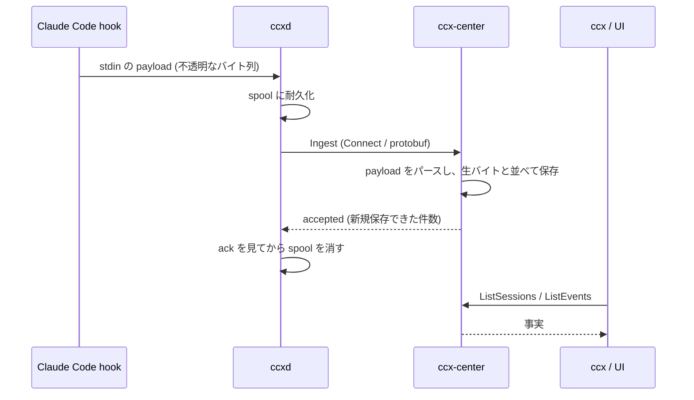

# ccx-center — the data sink

ccxd が集めた事実を受け取り、貯め、読み返せる形で返す。それだけをする (#91)。

judge しない。advise しない。「session X の context が 85% である」は答えるが、
「だから畳むべきだ」は答えない (`docs/design/scope.md`)。解釈は読んだ側の仕事。

## 名前が 2 つある

同じものを、ディレクトリでは `hub`、サービス名では `ccx-center` と呼んでいる。
`docs/design/architecture.md` は hub、`#91` と ccxd 側は center。config のキーも
`CCX_HUB_URL` (送る側) と `CCX_CENTER_*` (待つ側) で割れている。

今は割れたままにしてある。片方に寄せるのは docs / proto / config / ccxd に跨る
変更で、この PR の範囲を超えるため。どちらの名前も同じものを指す。

## 通り道



center が落ちている間、機械側は何も失わない。ccxd が spool に貯め、復旧後に順序
どおり流し込む。逆に center が上がっていても、機械側の動作は一切それに依存しない。

## パースはここでする

ccxd は payload を読まない。読むのはここ。理由は `packages/proto/ccx/v1/ingest.proto`
に書いてあるが、要点は 2 つ。

- ccxd の forward path に中身依存の分岐が無いことを、grep で検証できる状態に保てる
  (`scope.md`: COLLECT と CARRY のみ、CONSULT はしない)
- ccxd は他人の機械で動く単一バイナリでこちらから直せない。center のパーサは直せて、
  生バイトは常に残っているので、読み違えは後から読み直して直せる

その帰結として、**読めなかった payload も捨てない**。`parsed=false` を立てて行として
残す。捨てると「パーサが壊れている」と「その event が来ていない」が区別できなくなる。

## 鍵は (machine, user, session_id)

machine だけでは足りない。1 台に複数ユーザが居るとき、それぞれが自分の ccxd を自分の
権限で動かす (#90, #92)。2 ユーザは 2 本の別々の流れで、混ぜると後から分けられない。

`session_id` は Claude Code のもので ccx が採番したものではないので、単独では鍵に
しない。

## API

Connect (`ConnectRPC + Buf + Hono`)。契約は `packages/proto/ccx/v1/`。

| method | 答える問い |
|---|---|
| `IngestService/Ingest` | (ccxd が書く側) |
| `FleetService/ListSessions` | 今フリートに何が居るか |
| `FleetService/ListEvents` | session X は何をしたか / machine Y で T 以降に何が起きたか |

Connect とは別に、S3 互換の object API を同じポートで出す (下の「object API」)。

Connect は JSON でも話せるので、curl でそのまま叩ける。

```bash
curl -s -X POST http://127.0.0.1:8791/ccx.v1.FleetService/ListSessions \
  -H 'Content-Type: application/json' -d '{"activeOnly":true}'
```

### active とは何か

`ListSessions` の `activeOnly` は「SessionEnd を観測していない」という機械的な事実
だけを意味する。時間による判定はしない。

「未設定 = まだ動いている」ではない。ccxd が落ちていた・hook が配線されていない・
セッションが強制終了した、のいずれでも SessionEnd は来ない。生きているかを知りたい
読み手は `last_seen` からの経過も併せて見る。何分で死んだとみなすかは読み手の判断
なので、ここに閾値は置かない。

## 保存

sqlite (`bun:sqlite` + Drizzle)。テーブルは `events` の 1 つだけ。

session は行として持たず、event から `GROUP BY` で導く。session テーブルを別に持つと
2 つ目の真実源になり、raw と食い違ったときにどちらが正か言えなくなる。パーサを直せば
一覧もその場で直る、という性質もこの形から来ている。

重複排除は `event_id` (ccxd が採番する UUIDv7)。転送は at-least-once なので、同じ
event が二度届くのは異常ではなく正常系。

`Ingest` は全か無か。バッチの途中で落ちればトランザクションごと巻き戻り、1 件も
保存されない。ccxd はこの保証に乗って spool を消す。

## object API (S3 互換)

`ccx transcript` (#121) が session の transcript を置く先。center が「どこにでもある S3」
の 1 つになる形にしてあるので、`ccx transcript` も DuckDB の httpfs も既製の S3
クライアントのまま center を向ける。外部の S3 互換サービスを向けても同じ。

```text
GET    /                                     ListBuckets
PUT    /<bucket>                             CreateBucket (既にあっても 200)
HEAD   /<bucket>                             200
GET    /<bucket>?list-type=2&prefix=&delimiter=&max-keys=&continuation-token=&encoding-type=url
PUT    /<bucket>/<key>                       置く (staging に書いてから rename。stream で、本文をメモリに持たない)
GET    /<bucket>/<key>                       読む。Range は Bun.serve が切る (206)
HEAD   /<bucket>/<key>                       size / ETag (md5) / Last-Modified
DELETE /<bucket>/<key>                       消す (無くても 204)
POST   /<bucket>/<key>?uploads               multipart 開始
PUT    /<bucket>/<key>?partNumber=&uploadId= part
POST   /<bucket>/<key>?uploadId=             multipart 完了 (本文に並んだ part をその順に連結)
DELETE /<bucket>/<key>?uploadId=             multipart 中止
```

- 置き場所は `<objects dir>/<bucket>/<key>`。center を止めて `ls` するだけで中身が分かる
- bucket は暗黙に存在する。CreateBucket は mkdir で、未知の bucket の一覧は空
- 実装しているのは transcript の push / pull / 検索が使う範囲だけ。versioning / ACL / 署名検証は無い。署名は受け取るが見ない — 認証は center 全体で持つべきもので (「非 loopback bind は既定で拒む」)、ここだけ先に持たせても塞がらない
- ファイルシステムの上に置くことから来る制約: `a` と `a/b` は両立しない (S3 では両方置ける。後から来た方を 409 `KeyConflict` で断る) / `/` で終わる key (ディレクトリ marker) は置けない (400) / 1 セグメント 255 バイト超は 400 `KeyTooLongError` / Content-Type と `x-amz-meta-*` は保存しない / 一覧の `Contents` に ETag は載らない (載せるには全 object を読むことになる)
- 動かして確かめたクライアント: Bun.S3Client (`objects.test.ts`) / DuckDB httpfs (`ccx transcript search`、`apps/cli/src/search.test.ts`) / aws cli (`s3 ls` / `cp`、レビュー時)
- `/healthz` と `/ccx.v1.*` の route が先に照合されるので、`healthz` という名前の bucket は使えない (`ccx.v1.*` は大文字を含むので bucket 名として元から無効)
- 1 回の PUT で置ける大きさは 1 GB (`maxRequestBodySize`)。それより大きいものは multipart で

```bash
# 既製のクライアントで叩ける
AWS_ACCESS_KEY_ID=x AWS_SECRET_ACCESS_KEY=x aws --endpoint-url http://127.0.0.1:8791 s3 ls s3://ccx/transcripts/
```

## 設定

| what | env | default |
|---|---|---|
| bind address | `CCX_CENTER_HOST` | `127.0.0.1` |
| bind port | `CCX_CENTER_PORT` | `8791` |
| sqlite file | `CCX_CENTER_DB` | `$CCX_ROOT/center.db` (既定 `~/.ccx/center.db`) |
| object API の置き場所 | `CCX_CENTER_OBJECTS` | `$CCX_ROOT/center-objects` (既定 `~/.ccx/center-objects`) |
| 非 loopback bind を許す | `CCX_CENTER_ALLOW_INSECURE_BIND` | 未設定 = 許さない |

### 非 loopback bind は既定で拒む

この時点の center には**認証が無く、平文 HTTP で話す**。届く相手は誰でも event を
書けるし、集まった payload を全部読める。

なので loopback 以外への bind は起動時に拒否する (exit 2)。README に書いておくだけ
では、環境変数を 1 つ足した人には届かない。

```console
$ CCX_CENTER_HOST=0.0.0.0 ccx-center serve
ccx-center: refusing to bind 0.0.0.0: ccx-center has no authentication and speaks plain HTTP.
...
```

複数機械から使うときは、loopback のまま **TLS 終端と認証を持つ proxy を前に置く**。
その network を信頼していて承知のうえなら `CCX_CENTER_ALLOW_INSECURE_BIND=1` で越えられる。

loopback の判定は `127.0.0.0/8` 全体と `::1` / `localhost`。`127.0.0.1` だけを見ると
`127.0.0.2` を取りこぼす。

## 動かす

```bash
bun run apps/hub/src/index.ts serve
```

ccxd 側は center の URL を設定する (`CCX_HUB_URL` / `ccx.hubUrl` / `[hub] url`)。
未設定なら ccxd は spool するだけで、それも正常な状態。

## まだ無いもの

- 認証と TLS。だから非 loopback bind は明示の opt-in がなければ拒む (上記)
- 保持期間。`events` は無限に増える。ccxd 側の spool にも上限が無い (#90 から続く)。object API も同じで、置いたものは消すまで残る。完了も中止もされなかった multipart (`<objects dir>/.multipart/<uploadId>/`) も同じで、誰も掃かない
- object API の一覧は index を持たず、ページごとに prefix 配下を歩き直す。実測で 2 万 key のとき 1 ページ 0.55 s、全部で 15 s (レビュー時の計測)。transcript の数がそこに届いたら index を足す
- Web UI (#46)。ここは事実を返すだけで、描かない
- 会話としての読み方 (#63)、budget 集計 (#83)、group 解決 (#78)。すべてこのデータの
  上のクエリ
