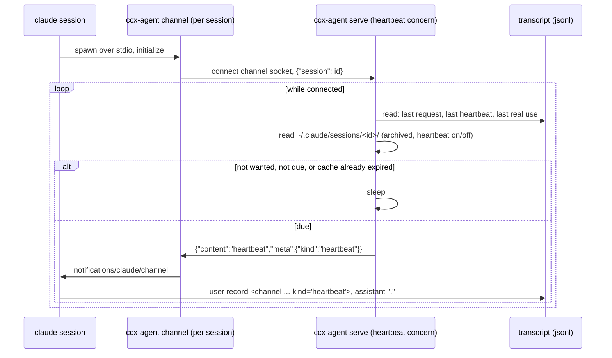

# Keeping an idle session's prompt cache warm

A session left alone for an hour loses its prompt cache, and the next turn rewrites the whole prefix
(~180k tokens). `ccx-agent channel` wakes the session for one short turn before that happens.

## Why this shape

- Claude Code requests a 1-hour TTL for the main conversation on a subscription (5 minutes on an API key
  or usage credits). No setting makes it longer. The hour counts from the start of the last request
  that read the entry, so each read restarts it.
- On a 5-minute TTL a heartbeat can never land in time. serve reads the TTL from the transcript (the last
  request's `usage.cache_creation`: `ephemeral_5m_input_tokens` vs `ephemeral_1h_input_tokens`) and does
  not beat such a session.
- Only a turn **in that session** reads its cache. `claude -p --resume <id>` does not: its MCP deltas
  differ, the prefix splits at ~13k tokens, and the rest is written again every time.
- A heartbeat is not free. On a Max plan (2026-09-23, 3-minute blocks against `api/oauth/usage`), about
  12.7M read tokens moved the 5h window by about 2% (idle blocks moved it 0-4% from other sessions; three
  fresh cache writes moved it about 6%). One heartbeat (~210k read) costs about 0.03%; the rewrite it
  saves on return (~180k written) about 1%. It pays when roughly 1 in 30 heartbeats leads to a return,
  and a single heartbeat followed by a return pays 30 times over.
- An earlier measurement (2026-09-21, a company account before its move to a Team plan) moved 0% for
  20.0M read. Plans may count reads differently; measure the one in use.
- Hence off by default: a session is kept warm only when it, or its person, says it will be back.
- Source measurements: vault `claude-code-prompt-cache-keepalive.md`; the 2026-09-23 figures are in kaneo
  ccx#10.

## How it works

- Claude Code spawns `ccx-agent channel` per session over stdio (ADR 0002); it exits when stdin closes.
  It only relays: it registers the session with serve and pushes what serve sends. With serve down it
  keeps serving MCP and retries every minute.
- serve decides. The clock is the session's own transcript; the settings are ccx's config, so changing
  them needs no session restart. ccx holds the session's state (`scope.md`), and whether a session is
  kept warm is part of it (user decision 2026-09-24).
- The server's instructions tell the session to answer a heartbeat with `.` and nothing else.

## Settings

| What | config.toml `[heartbeat]` | env | git config | default |
|---|---|---|---|---|
| concern on/off | `enabled` | `CCX_HEARTBEAT` | `ccx.heartbeat` | on (inert until a session loads the channel) |
| sessions with no declaration | `default` | `CCX_HEARTBEAT_DEFAULT` | `ccx.heartbeatDefault` | off |
| interval | `interval` | `CCX_HEARTBEAT_INTERVAL` | `ccx.heartbeatInterval` | `50m` |
| stop after no real use for | `maxIdle` | `CCX_HEARTBEAT_MAX_IDLE` | `ccx.heartbeatMaxIdle` | `12h` (`off` = no cap) |
| channel socket | — | `CCX_CHANNEL_SOCKET` | — | `ccx-channel.sock` next to the hook socket |

- serve reads these at start; restart it to apply (sessions reconnect on their own within a minute). There
  is no reload on SIGHUP: a restart is one command and costs the sessions nothing, and one path is less to
  get wrong. A restart does forget which heartbeats are in flight.
- A value that cannot be used (a typo, an interval of 1h or more), or a channel socket that cannot be set up
  (path too long, another serve holding it), turns the heartbeat concern off and says why in serve's log;
  collect keeps running.
- A session overrides `default` for itself with `ccx session heartbeat on|off` (`default` clears it). It is
  declared state (`~/.claude/sessions/<id>/heartbeat`), read on every poll, so it applies within a minute.
- Without an id the command targets `CLAUDE_CODE_SESSION_ID`, so a session can decide for itself (run it
  from its own Bash). When a session should turn it on is methodology and stays outside ccx (`scope.md`).

## Measured end to end (2026-09-23, Claude Code 2.1.280, 40s interval)

| turn | cache read | cache write |
|---|---|---|
| 1 person | 25,014 | 184,339 |
| 2 heartbeat | 26,898 | 182,489 |
| 3 person | 209,387 | 43 |
| 4 heartbeat | 209,387 | 77 |

- Turn 2 rewrites the prefix whatever arrives: a second session where turn 2 was a person read 26,899 and
  wrote 182,615, the same as the heartbeat here. From turn 3 a heartbeat reads exactly what a person's
  turn reads.
- The session answered `.` and closed the turn.
- At the default 50 minutes (same day, second session):

| turn | at | cache read | cache write |
|---|---|---|---|
| 2 person | 12:44:14 | 26,899 | 182,615 |
| 3 heartbeat | 13:34:14 (+50m) | 26,899 | 182,649 |
| 4 person | 13:37:22 | 209,548 | 38 |
| 5 heartbeat | 14:27:25 (+50m) | 209,548 | 72 |

- Turn 5 is the claim: a heartbeat 50 minutes after the last request reads the whole 1h cache. Turn 3 split
  at the same point as turn 2, and nothing was written to the transcript in between; the cause is not
  identified. It is not the TTL (every write was `ephemeral_1h`, and a person's turn in another session read
  364,157 after a 49-minute gap) and not the heartbeat (turn 4 read what turn 3 wrote). The likely cause is
  the MCP connection state changing during the hour, which splits a person's turn the same way.
- Release build (v0.1.1-rc.10, Claude Code 2.1.282, d1, 2026-09-25, started with `claude-with-channel`):

| turn | at (JST) | cache read | cache write |
|---|---|---|---|
| 1 person | 10:23:59 | 25,127 | 189,974 |
| 2 person | 10:24:20 | 215,101 | 54 |
| 3 heartbeat | 11:14:20 (+50m) | 215,155 | 34 |

- Turn 3 read the whole prefix on the first heartbeat after the first person turns, so the split seen
  above (and once more on m1 with rc.8) did not reproduce here. The cause of that split is still not
  identified. A second heartbeat was not measured (the host rebooted before it was due).
- The claim end to end: two sessions started together (d1, v0.1.1-rc.11, 2026-09-25), the same two
  person turns, one with the heartbeat on and one declared off, then a person turn in both 71 minutes
  after the last person request (past the hour for the one without a heartbeat; 21 minutes after the
  heartbeat's request for the one with it):

| turn | at (JST) | on: cache read | on: cache write | off: cache read | off: cache write |
|---|---|---|---|---|---|
| 2 person | 14:59:09 | 166,107 | 100 | 166,105 | 84 |
| heartbeat (on only) | 15:49:09 (+50m) | 166,207 | 34 | - | - |
| 3 person | 16:10:12 (+71m) | 166,241 | 47 | 25,127 | 141,107 |

- The session with the heartbeat read its whole cache 71 minutes on; the one without rewrote it (the
  25,127 it read is the part shared with every session). Over d1's transcripts since 2026-09-11,
  counting a turn as reading the whole cache when its cache read is at least its cache write: a person
  turn 60 minutes or more after the last request with no heartbeat in between did 0 times of 85, and a
  person turn 40 minutes or more but under 60 after the last request did 27 times of 27.
- The channel must be registered in `~/.claude.json` (`claude mcp add`); a server passed with
  `--mcp-config` is refused as `no MCP server configured with that name`.

## When it does not beat

| Condition | Why |
|---|---|
| `~/.claude/sessions/<id>/archived` exists | declared folded away; its cache is not wanted |
| an hour or more since the last request that answered started (resumed, host suspended, a heartbeat whose request failed) | the cache is already gone; a heartbeat would only pay the rewrite early |
| a turn is running (below) | a heartbeat would queue behind the turn and run as an extra turn after it |
| the last request wrote a 5-minute cache | it is always gone 50 minutes later |
| no real use for `CCX_HEARTBEAT_MAX_IDLE` (12h; `off` = no cap) | a session nobody returns to is not worth waking forever |
| the last heartbeat is not in the transcript yet, and nothing else happened since | mid-turn, or `/clear` moved the session to a new id; never stack a second. Real use after the push means it was lost, and beating resumes |
| less than an interval since the last heartbeat landed | a heartbeat whose answer failed must not make the next one due at once |
| no `ccx session heartbeat on` for the session (the default is off), or `off` declared | not wanted |
| `[heartbeat] enabled = false`, or `interval = "off"` | turned off for the machine |

"Real use" is any record outside a heartbeat turn. A heartbeat turn runs from its user record to the
next user prompt or channel event that is not a heartbeat. Only the opening tag of an `isMeta` channel
event is matched, and the attribute name whole (`event_kind="heartbeat"` is not it), so a person or a
tool quoting the attribute is not a heartbeat.

The clock is the start of the last answered request: the first user record up the `parentUuid` chain
of the response's first record (attachments sit in between). The cache is read when a request starts,
and a response can take minutes. The chain is followed rather than the content read: cross-session
messages and channel events are meta records that start a turn, and a `!` line can too. Later records
of the same response (same `message.id`) keep its start rather than follow their own chain: tools run
while the response streams, so a tool's result can be the parent of a later block of that response.
Following the chain there moved the clock and cleared a sibling tool still running, and a heartbeat
could then land in the middle of the turn. Measured on d1 on 2026-09-25 over the transcripts of the
last 14 days (9,580 responses): 661 blocks had a tool result as parent while their `message.id` was
already seen, and in 10 of them a sibling tool had not returned yet. A
synthetic API-error reply (`isApiErrorMessage`) is not an answer.

"A turn is running" is a tool that has not returned, or a user record newer than the last response and
under 5 minutes old. Some user records never get a response (Esc, a manual `/compact`, a stopped task's
notice); past 5 minutes they are taken not to be a turn (measured 2026-09-24: input to response p99 30s,
max 116s). This is a heuristic, not a completion signal: a response slower than 5 minutes gets one extra
heartbeat turn queued behind it (about 0.03% of the 5h window), which costs less than stopping keepalive
after every Esc.

The heartbeat starts only after the client sends `notifications/initialized`: a push before that is
outside the MCP lifecycle and can be dropped silently.

## Marking heartbeat turns for other tools

A heartbeat is a user record with `isMeta: true` whose content is
`<channel source="<server name>" kind="heartbeat">`. Anything that counts a session's activity (idle
reapers, turn metrics, hooks) must skip it, or a heartbeat keeps an abandoned session looking busy. The
stable part is the attribute ` kind="heartbeat"` (with its leading space); `source` is whatever name the user registered the server under.

- Stop hooks run on every heartbeat turn (observed: all 6 of the test session's Stop hooks, each time). A
  Stop hook that notifies a person fires every 50 minutes per idle session unless it skips heartbeats.
- Whether UserPromptSubmit runs for a channel event is not measured here: the transcript records Stop hooks
  but not UserPromptSubmit, for a person's turn as well. `transport.md` says it runs.
- ccx's own `collect` forwards those Stop events to the center as it does any other.

## Rejected

- Timer in the channel process, settings as env on the MCP registration (the first cut of #142): it keeps
  working without serve, but the settings are fixed per session at spawn and cannot be changed without
  restarting every session, and it keeps a piece of session state outside ccx (user decision 2026-09-24).
  The serve → channel connection is also the local half of what #23 and #138 need.
- Measuring idleness from the transcript mtime: records written after the last request (titles, snapshots)
  move it later than the request, and the heartbeat would land after the TTL.
- Stop hook times from `collect`: needs hooks wired and `serve` running; the transcript already has them.
- Blocking the heartbeat prompt in a UserPromptSubmit hook: a blocked prompt makes no request, so it
  reads no cache.

## Later

- ccx-center should see every machine's ccx-agent settings, while each machine keeps them in its local
  file (user, 2026-09-24: "the final shape"). Not built. Today the declared-state event sent to the
  center carries a session's heartbeat override, but the center indexes only archived / label / task, and
  nothing sends `config.toml`.
- The center should not read a heartbeat's Stop event as the session being used.
- After `/clear` the channel still registers the old session id, so the new conversation is not kept warm.
  The current id is in `~/.claude/sessions/<claude pid>.json`; the channel could resolve it from its parent.
- Delivery is inferred from the heartbeat's user record appearing. The transcript also records a
  `queue-operation` when the event is queued, which would tell "queued, turn not ended yet" apart.
