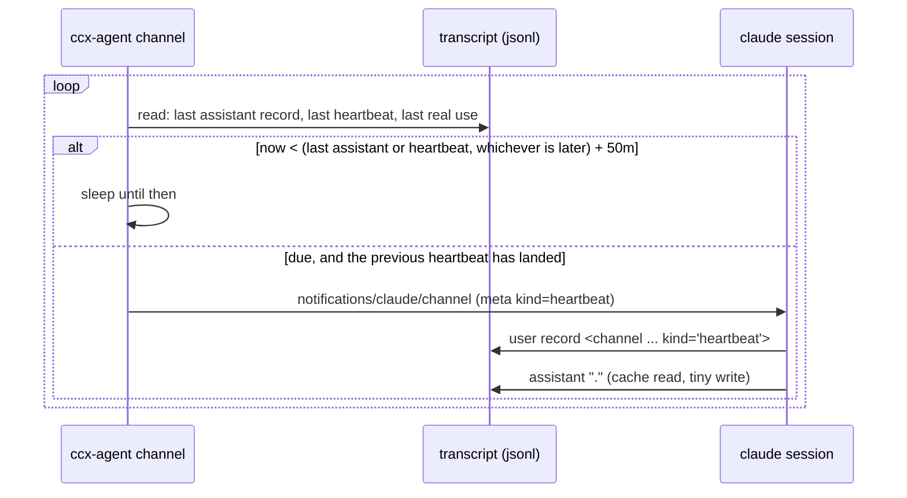

# Keeping an idle session's prompt cache warm

A session left alone for an hour loses its prompt cache, and the next turn rewrites the whole prefix
(~180k tokens). `ccx-agent channel` wakes the session for one short turn before that happens.

## Why this shape

- Claude Code requests a 1-hour TTL for the main conversation on a subscription (5 minutes on an API key
  or usage credits). No setting makes it longer. The hour counts from the start of the last request
  that read the entry, so each read restarts it.
- On a 5-minute TTL a heartbeat can never land in time. Turn it off there (`CCX_HEARTBEAT_INTERVAL=off`).
- Only a turn **in that session** reads its cache. `claude -p --resume <id>` does not: its MCP deltas
  differ, the prefix splits at ~13k tokens, and the rest is written again every time.
- The read is almost free on a subscription (measured 2026-09-21: 20.0M read tokens moved the 5h window
  by 0%, 180k written moved it by 1%).
- Source measurements: vault `claude-code-prompt-cache-keepalive.md`.

## How it works

- Claude Code spawns `ccx-agent channel` per session over stdio (ADR 0002); it exits when stdin closes.
- The clock is the session's own transcript, found by `CLAUDE_CODE_SESSION_ID`. No `ccx-agent serve`,
  no center: the invariant in `scope.md` holds.
- The server's instructions tell the session to answer a heartbeat with `.` and nothing else.

## Measured end to end (2026-09-23, Claude Code 2.1.280, 40s interval)

| turn | cache read | cache write |
|---|---|---|
| 1 person | 25,014 | 184,339 |
| 2 heartbeat | 26,898 | 182,489 |
| 3 person | 209,387 | 43 |
| 4 heartbeat | 209,387 | 77 |

- Turn 2 (here a heartbeat) rewrote the prefix; turn 3 (a person) then read all of it. Only the heartbeat
  was observed as turn 2, so whether a person's turn 2 splits the same way is not measured. From turn 3
  a heartbeat reads exactly what a person's turn reads.
- The session answered `.` and closed the turn.
- The channel must be registered in `~/.claude.json` (`claude mcp add`); a server passed with
  `--mcp-config` is refused as `no MCP server configured with that name`.

## When it does not beat

| Condition | Why |
|---|---|
| `~/.claude/sessions/<id>/archived` exists | declared folded away; its cache is not wanted |
| an hour or more since the last request (resumed, host suspended) | the cache is already gone; a heartbeat would only pay the rewrite early |
| no real use for `CCX_HEARTBEAT_MAX_IDLE` (12h; `off` = no cap) | a session nobody returns to is not worth waking forever |
| the last heartbeat is not in the transcript yet, and nothing else happened since | mid-turn, or `/clear` moved the session to a new id; never stack a second. Real use after the push means it was lost, and beating resumes |
| less than an interval since the last heartbeat landed | a heartbeat whose answer failed must not make the next one due at once |
| `CCX_HEARTBEAT_INTERVAL=off` | turned off |

"Real use" is any record outside a heartbeat turn. A heartbeat turn runs from its user record to the
next user prompt or channel event that is not a heartbeat. Only the opening tag of an `isMeta` channel
event is matched, so a person or a tool quoting the attribute is not a heartbeat.

The heartbeat starts only after the client sends `notifications/initialized`: a push before that is
outside the MCP lifecycle and can be dropped silently.

## Marking heartbeat turns for other tools

A heartbeat is a user record with `isMeta: true` whose content is
`<channel source="<server name>" kind="heartbeat">`. Anything that counts a session's activity (idle
reapers, turn metrics, UserPromptSubmit / Stop hooks) must skip it, or a heartbeat keeps an abandoned
session looking busy. The stable part is `kind="heartbeat"`; `source` is whatever name the user
registered the server under.

## Rejected

- Timer in `ccx-agent serve`, pushed through a socket to the channel: the heartbeat would stop whenever the
  resident agent is down, for no gain. `serve` is where broker messages (#23) will come from; the
  heartbeat needs nothing from it.
- Measuring idleness from the transcript mtime: records written after the last request (titles, snapshots)
  move it later than the request, and the heartbeat would land after the TTL.
- Stop hook times from `collect`: needs hooks wired and `serve` running; the transcript already has them.
- Blocking the heartbeat prompt in a UserPromptSubmit hook: a blocked prompt makes no request, so it
  reads no cache.
