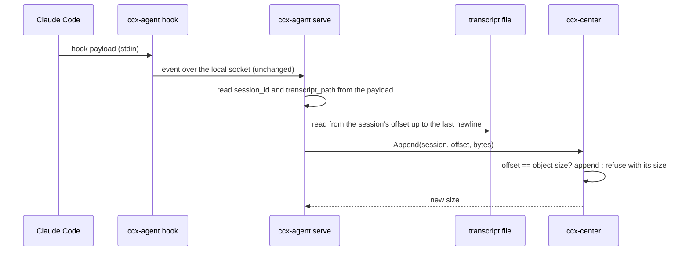

# Live transcript

A session's transcript reaches the store only after it ends (`ccx transcript push`). Until then the
center knows what the hooks said — prompts, tool calls, the final answer of a turn — and nothing
the transcript alone carries: the model, token usage, effort, the assistant's words between tool
calls, a `/model` switch, PR links (#120 has the measured list). This document makes the store's
`transcript.jsonl` grow while the session runs, so the center holds the conversation as it happens
and the copy in the store is the same file from the first turn on. (#120)

Questions that need an answer are in the session's judgment queue, not here.

## What it is for

- The center can show what every running session is doing, across machines, without waiting for
  the session to end (the view itself is #46).
- The records that carry usage, model and effort reach the store for headless sessions too: hooks
  fire under `claude -p`, the statusline does not. Deriving them is the reader's job (#46).
- The store's copy stops lagging. A machine that dies mid-session leaves its conversation in the
  store up to the last hook. `search` reads it; `ls` / `pull` still need a `session.json`, which
  only `push` writes (#208).

## The path

The hook does not change: it still writes the payload to the socket and returns (#18). Reading the
file happens in `ccx-agent serve`, off the session's critical path — a hook that already takes a
second on a busy disk (#194) must not also read a transcript.

## The boundary moves by two fields

`ingest.proto` says ccx-agent never parses a hook payload. This keeps that rule for the payload's
content and narrows it for its address: ccx-agent reads `session_id` and `transcript_path`, and
nothing else — not even which hook fired — and branches on neither's meaning. The event is still
forwarded byte for byte; a payload whose two fields do not parse is forwarded as before and simply
triggers no read.

`transcript_path` comes from a file other processes of the same user can write, so it is taken only
when the file name is `<session_id>.jsonl`, the id has Claude Code's shape, and the path sits in a
`projects/` directory. The open refuses a symlink in the file's place and anything that is not a
regular file. A later payload naming another such path (a resume in another project directory)
moves the session there.

## The center appends

The center writes the bytes onto `transcripts/machine=<m>/user=<u>/session_id=<id>/transcript.jsonl`,
the object `pull`, `prune` and `search` already read (`transcript-store.md`). An append is accepted
only when its offset equals the object's current size; otherwise the center refuses and returns its
size. That one rule gives:

- Duplicates and reordering cannot corrupt the object: a resend of bytes already there is refused
  with a size the sender is already past.
- ccx-agent keeps offsets in memory only. A session it has not seen yet (after a restart, or after it
  forgot an idle one) starts with an empty append at offset 0, which appends nothing and is answered
  with the real size; it sends from there. Nothing is spooled: the transcript file is the durable
  source, and it stays on disk until someone prunes it after a verified copy.
- A gap is impossible to write. If the agent's offset is ahead of the center (the object was deleted),
  it is told the size and starts over from it.
- The size alone does not say the object is this file's beginning: another machine's copy of the
  same session may have been pulled over the local file, with the same length. So every append also
  carries the last few KiB before its offset, and the center appends only when its object ends with
  them; otherwise it refuses with `DATA_LOSS`, and the agent stops the session rather than splice two
  copies into one that exists nowhere. A stopped session starts over (asking for the size again) at
  its first hook an hour or more later, by when a `push` may have put the object right.
- The same check runs with no data: right after the size is learned, and on every settled read. That
  is how a caught-up session notices that a `push` put back an older snapshot (its file has not
  grown, so it would send nothing) and how a different copy is found before a chunk is shipped.

Writes to one key are serialised in the center, so an append and a `push` of the same transcript do
not interleave. `push` keeps replacing the whole object; when it carries the same bytes, nothing
changes, and when the local file differs (see below), the push is what makes the store right again.

A reader must not see half an append. The object store serves a live object only up to the length of
the last completed append (GET's length and body come from one snapshot), so a DuckDB query running
during an append sees whole lines. That snapshot holds against appends only: a `push` or a `DELETE`
that replaces the object while a GET is streaming can still change what the body reads (#209). A failed append is cut back to its old length. A center that dies
in the middle of one can leave part of a line; the agent's next append is refused with the longer
size, and it sends the rest of that line from there, so the object is whole again at the next read.

A `DELETE` of the object waits for an append in progress, and so does the moment a `push` replaces
it. The push's body is received before that, outside the wait, so a slow upload holds up nobody. The
price: appends that land while a push uploads are replaced by the push's older snapshot; the
session's next settled read finds the object shorter than its offset and sends them again.

The center must understand `expected_tail` before agents send it: a center that does not drops the
field and appends without checking. Update the center first.

A center refusal that retrying cannot fix stops live sync instead of retrying it: a center without
`TranscriptService` or a refused token stops it for every session, a request the center calls
invalid stops it for that session. Anything else (the center down, a timeout) is retried with a
doubling delay, and the log says so once when it starts failing and once when it recovers.

## When it reads

- Every hook event of a session is a trigger. Reading is coalesced per session: at most one read per
  interval, plus one trailing read after the interval, so the last trigger in a burst is never
  dropped — only merged into the next read.
- Claude Code writes the transcript asynchronously; when a hook fires, the lines it is about may not
  be on disk yet, and after the last hook of a turn nothing else would read them. So every trigger
  also asks for one more read shortly after the last trigger. If that read finds a line still being
  written, it asks again, a bounded number of times.
- Only whole lines are sent: the read stops at the last newline, and a line still being written waits
  for the next read. A single append carries at most a fixed cap; the rest follows at once. A single
  line longer than the cap is sent alone.
- A session that fires no hook between two of its writes is read at its next hook. Sessions without
  ccx's hooks are not seen at all; that is the same limit the hook events have.

## When the local file stops being a prefix

The design assumes Claude Code only appends to a transcript. If the local file becomes shorter than
the center's copy (a truncation, e.g. by a tool that cuts a session to make it resumable), the agent
stops appending for that session and says so in its log. It does not try to repair: the
next `push` replaces the object with the local file. A restarted agent learns the center's size,
finds the file shorter than it, and stops the session again. A rewrite that keeps the same length is not
detected here; `push` compares the sha256 and catches it at the end.

## Only when the store is the center

S3 has no append. Live sync runs only when the transcript store is the center's own object API —
the same condition under which the store uses the hub's token today (endpoint unset, or equal to the
hub URL). With the store elsewhere (MinIO, R2, AWS), the agent does not start live sync and says
why in its log; `push` works as before. Live sync can also be turned off (`CCX_TRANSCRIPT_LIVE` /
`[transcript] live`, default on); it has no git config key.

## What `push` still does

`push --ended` (and #129, which automates it) still carries the files the JSONL refers to —
`tool-results/`, `subagents/`, `workflows/` — plus `session.json` and `state.json`. It also still
uploads the transcript whenever the local file differs from what the last `push` recorded, which
after live sync is every time: the bytes it writes are the ones the object already holds, so it costs
transfer, not correctness.

`pull` checks the download against `session.json`. A copy that live sync grew after the push is
accepted when the bytes the push hashed are its prefix and it ends with a newline. A local file
that already exists is compared with the downloaded copy, not with `session.json`: the same bytes
are already here, a shorter local file that is the copy's beginning is an older copy and is
replaced without `--force`, and anything else still needs `--force`. The comparison is made against
the download itself, so a push that replaces the object mid-pull cannot make it compare one copy and
install another. When the local file is `session.json`'s copy and the object has not grown, nothing
is downloaded.

## Not here

- Subagent transcripts. They are separate files; `SubagentStop` names them, and the same mechanism
  can follow them later.
- Pushing to viewers. The view polls the center (#46).
- Interpreting the lines in ccx-agent. The center derives model, usage and the rest from the stored
  lines, as it derives everything else from raw bytes.

## Acceptance

- A headless session's records (model and token usage among them) reach the store while it runs.
- Each read costs the new bytes, not the file's size.
- A partly written line is never sent, and a refused or failed append never leaves a partial line in
  the store (a center that dies mid-append can, until the agent's next read).
- A refusal that retrying cannot fix stops live sync; an outage is retried with backoff.
- Restarting ccx-agent mid-session neither duplicates nor skips bytes.
- With the center down, hooks take no longer than before, and the store catches up when it returns.
- A truncated local file stops the session's live sync without writing to the store.
