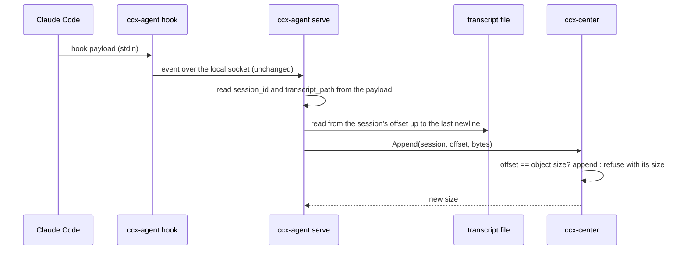

# Live transcript

A session's transcript reaches the store only after it ends (`ccx transcript push`). Until then the
center knows what the hooks said — prompts, tool calls, the final answer of a turn — and nothing
the transcript alone carries: the model, token usage, effort, the assistant's words between tool
calls, a `/model` switch, PR links (#120 has the measured list). This document makes the store's
`transcript.jsonl` grow while the session runs, so the center holds the conversation as it happens
and the copy in the store is the same file from the first turn on. (#120)

Questions that need an answer are in the session's judgment queue, not here.

## What it is for

- The center can show what every running session is doing, across machines, without waiting for
  the session to end (the view itself is #46).
- Usage, model and effort reach the center for headless sessions too: hooks fire under `claude -p`,
  the statusline does not.
- The store's copy stops lagging. A machine that dies mid-session leaves its conversation in the
  store up to the last hook, and `push` at the end has nothing left to carry for the transcript.

## The path

The hook does not change: it still writes the payload to the socket and returns (#18). Reading the
file happens in `ccx-agent serve`, off the session's critical path — a hook that already takes a
second on a busy disk (#194) must not also read a transcript.

## The boundary moves by two fields

`ingest.proto` says ccx-agent never parses a hook payload. This keeps that rule for the payload's
content and narrows it for its address: ccx-agent reads `session_id` and `transcript_path`, and
nothing else, and branches on neither's meaning. The event is still forwarded byte for byte; a
payload whose two fields do not parse is forwarded as before and simply triggers no read.

`transcript_path` comes from a file other processes of the same user can write, so it is taken only
when the file name is `<session_id>.jsonl`, the id has Claude Code's shape, and the path sits in a
`projects/` directory. Anything else is ignored, not followed.

## The center appends

The center writes the bytes onto `transcripts/machine=<m>/user=<u>/session_id=<id>/transcript.jsonl`,
the object `pull`, `prune` and `search` already read (`transcript-store.md`). An append is accepted
only when its offset equals the object's current size; otherwise the center refuses and returns its
size. That one rule gives:

- Duplicates and reordering cannot corrupt the object: a resend of bytes already there is refused
  with a size the sender is already past.
- ccx-agent keeps offsets in memory only. After a restart it sends from 0, is told the real size, and
  continues from there. Nothing is spooled: the transcript file is the durable source, and it stays
  on disk until someone prunes it after a verified copy.
- A gap is impossible to write. If the agent's offset is ahead of the center (the object was deleted),
  it is told the size and starts over from it.

Writes to one key are serialised in the center, so an append and a `push` of the same transcript do
not interleave. `push` keeps replacing the whole object; when it carries the same bytes, nothing
changes, and when the local file differs (see below), the push is what makes the store right again.

A reader must not see half an append. The object store serves a live object only up to the length of
the last completed append, so a DuckDB query running during an append sees whole lines.

## When it reads

- Every hook event of a session is a trigger. Reading is coalesced per session: at most one read per
  interval, plus one trailing read after the interval, so the last trigger in a burst is never
  dropped — only merged into the next read.
- Claude Code writes the transcript asynchronously; at `Stop` the turn's last lines may not be on
  disk yet. `Stop`, `SubagentStop` and `SessionEnd` schedule one more read shortly after.
- Only whole lines are sent: the read stops at the last newline, and a line still being written waits
  for the next read. A single append carries at most a fixed cap; the rest follows at once. A single
  line longer than the cap is sent alone.
- A session that fires no hook between two of its writes is read at its next hook. Sessions without
  ccx's hooks are not seen at all; that is the same limit the hook events have.

## When the local file stops being a prefix

The design assumes Claude Code only appends to a transcript. If the local file becomes shorter than
the center's copy (a truncation, e.g. by a tool that cuts a session to make it resumable), the agent
stops appending for that session and says so in its log and status. It does not try to repair: the
next `push` replaces the object with the local file. A rewrite that keeps the same length is not
detected here; `push` compares the sha256 and catches it at the end.

## Only when the store is the center

S3 has no append. Live sync runs only when the transcript store is the center's own object API —
the same condition under which the store uses the hub's token today (endpoint unset, or equal to the
hub URL). With the store elsewhere (MinIO, R2, AWS), the agent does not start live sync and its
status says why; `push` works as before.

## What `push` still does

The transcript itself arrives live, so `push --ended` (and #129, which automates it) is left with
the files the JSONL refers to — `tool-results/`, `subagents/`, `workflows/` — plus `session.json`,
`state.json`, and the final check that the store's copy matches the local file.

## Not here

- Subagent transcripts. They are separate files; `SubagentStop` names them, and the same mechanism
  can follow them later.
- Pushing to viewers. The view polls the center (#46).
- Interpreting the lines in ccx-agent. The center derives model, usage and the rest from the stored
  lines, as it derives everything else from raw bytes.

## Acceptance

- A headless session's model and token usage reach the center while it runs.
- Each read costs the new bytes, not the file's size.
- A partly written line is never sent, and a refused append never leaves a partial line in the store.
- Restarting ccx-agent mid-session neither duplicates nor skips bytes.
- With the center down, hooks take no longer than before, and the store catches up when it returns.
- A truncated local file stops the session's live sync without writing to the store.
