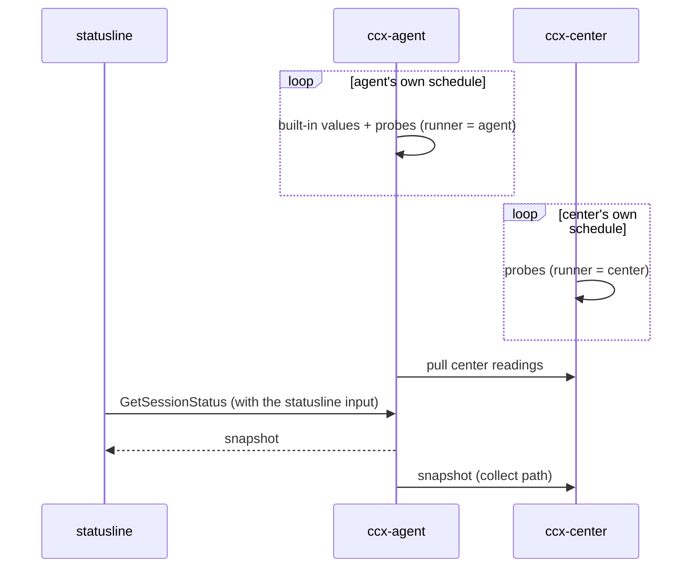

# The statusline draws; ccx-agent and the center fetch

The statusline asks ccx-agent once per render and draws what comes back. Everything it shows is fetched
ahead of time: per-machine and per-session values by ccx-agent, and values that belong to no machine by
the center. The statusline also hands ccx-agent the JSON Claude Code gave it, because some values exist
nowhere else. Values that only one user's environment has (a cloud bill, a GPU notebook) are not ccx's
words; ccx runs the user's commands for them and carries the output without reading it.

## Why

- Today the statusline (claude-config `statusline-command.sh`, 1576 lines of bash, read 2026-09-28) is
  both the fetcher and the view. Each render runs `git` 4-5 times, `df`, `akapen list`, `jq` on several
  files and `ccx-agent status`; `bg_cached` starts `gh`, `docker ps`, `rc-status`, cost and quota scripts
  in the background when a `/tmp` cache is older than its TTL.
- Fetching is driven by rendering. A value goes stale while nothing renders, and N sessions on one
  machine fork N times for values that are the same for all of them.
- Values that are the same across machines (a PR's CI state) are fetched once per machine.
- The center cannot see any of it: a session's context use, its rate limits, its branch, exist only in a
  terminal.
- How long one render takes, and which item costs what, is not measured yet (step 0 below). #189
  measured `ccx-agent status` alone at up to 2s under load average 30 on 4 cores.

## To-Be



- One round trip per render, as today. The request gains the statusline input; the response gains the
  snapshot.
- No network on the render path. When the center is down the statusline draws from what ccx-agent last
  pulled.
- The center sees every machine's snapshots.

## What each side can fetch

### ccx-agent alone, per machine

- load, memory, disk, CPU count, running containers, host, user
- read from `/proc` and local sockets; the same for every session on the machine, so fetched once

### ccx-agent alone, per session

- git (branch, dirty, ahead/behind, stash, last commit), from the session's cwd. The cwd arrives with
  hook events and with the statusline input
- the herdr pane id (#94), Remote Control state, loaded channels: from the Claude Code process, found
  through `~/.claude/sessions/<pid>.json`
- turns: counted from `UserPromptSubmit` events the collect concern already receives
- tool-specific session facts (a kaneo attachment, an akapen review) are probes, not built-ins: they are
  the user's tools

### The center alone

- values that are the same whichever machine asks: a PR's state and CI (keyed by repo and branch),
  a public status page
- only as probes (below); ccx builds none of these in

### Only from the statusline input

- model, effort, thinking, fast mode, vim mode, output style, agent name
- context window use and token counters, cost durations
- rate limits (5h / 7d), Claude Code version, the PR Claude Code found, session name
- Claude Code gives these to the statusline and to nothing else. Some could be rebuilt from the
  transcript, but not to the same values, and rate limits not at all

### Only in the statusline

- the render count: it counts renders

## Probes

A probe is a command the user configures, run on an interval by ccx-agent or by the center. Its stdout
is the reading, kept under the probe's key. ccx gives the key and the reading no meaning, the same line
as `metadata` in `session-state.md`.

```toml
# ~/.config/ccx/config.toml
[[probe]]
key = "modal"
command = "modal-cost-refresh"
interval = "15m"
runner = "center"       # agent | center
scope = "global"        # machine | session | account | global

[[probe]]
key = "ai-quota"
command = "ai-quota-refresh"
interval = "5m"
runner = "agent"
scope = "account"
```

- `runner` decides where the command runs, and so where its credentials must be. A quota that depends
  on which Claude account a machine is logged in with runs on that machine's agent
- `scope` decides who shares a reading:
  - `machine`: every session on the machine
  - `session`: one session; the command gets the session id and cwd in its environment
  - `account`: sessions logged in with the same Claude account (the login email). Different machines on
    the same account share it; a machine on another account does not
  - `global`: everyone
- A reading keeps when it was taken and whether the last run failed, so the statusline can mark a stale
  value instead of showing it as current. A failed run keeps the previous reading
- Readings of `runner = center` reach the statusline through ccx-agent's pull, never directly

## Account-scoped values from the statusline input

- Rate limits belong to the Claude account, not the machine. ccx-agent keys them by the login email and
  forwards them; the center can then show what is left per account across machines (#83)

## Steps

Each step lands on its own. The statusline drops its own fetching for an item in the same step that
makes ccx-agent serve it. Steps 2 and 3 swap if step 0 shows per-session items cost more.

| Step | What | Repos | Needs |
|---|---|---|---|
| 0 | Measure one render: ms and forks per item | claude-config | - |
| 1 | The statusline input rides on `GetSessionStatus`; ccx-agent keeps the latest per session | ccx, claude-config | - |
| 2 | Per-machine built-ins fetched on ccx-agent's schedule | ccx, claude-config | 1 |
| 3 | Per-session built-ins | ccx, claude-config | 1 |
| 4 | Snapshots forwarded to the center and shown there | ccx | 1 |
| 5 | Probes on ccx-agent | ccx, claude-config | 1 |
| 6 | Probes on the center, pulled by ccx-agent | ccx, claude-config | 4, 5 |

## Rejected

- Fetch everything at the center: git, load and a session's process live on the machine
- The statusline asks the center: a LAN round trip on the render path, and no statusline when the
  center is down
- ccx-agent rebuilds the statusline input from the transcript: rate limits, effort and fast mode are not
  in it
- Build the user's cost and quota sources into ccx: they exist in one user's environment; ccx would carry
  their names and their credentials
- A center that fetches account values for everyone: machines are logged in with different accounts, so
  "the account" is not one thing

## Open

- Whether the cwd from hook events follows a session that changes directory, or only the statusline
  input does
- How the center gets credentials for its probes (the center host runs them as its user; nothing is
  decided about how secrets reach it)
- Status response time under load (#189) must stay within the statusline's budget once the response
  carries more; the snapshot is prepared ahead, so the request only reads memory
