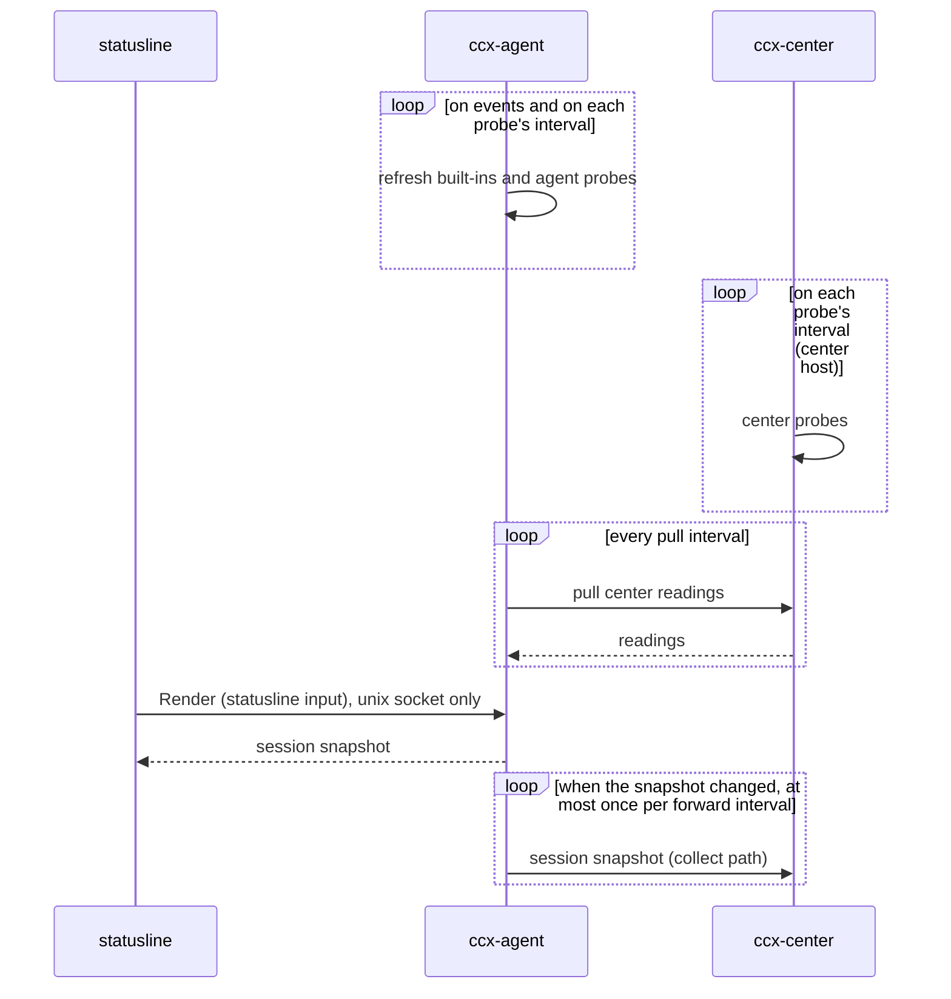

# The statusline draws; ccx-agent and the center fetch

The statusline asks ccx-agent once per render and draws the session snapshot that comes back. Per-machine and per-session values are fetched by ccx-agent off the render path. The statusline hands ccx-agent the JSON Claude Code gave it, because some values exist nowhere else. Values that only one user's environment has (a cloud bill, a GPU notebook, a PR's CI) are not ccx's words: ccx runs the user's commands for them (probes) and carries the output without reading it.

## Why

- Today the statusline (claude-config `statusline-command.sh`) is both the fetcher and the view. Each render runs `git` 8-9 times, `df`, `akapen list`, `jq` on several files and `ccx-agent status`; `bg_cached` starts `gh`, `docker ps`, `rc-status`, `claude auth status`, cost and quota scripts in the background when a machine-wide `/tmp` cache is older than its TTL. It also pushes to the herdr sidebar (`herdr pane report-metadata`).
- The work runs in the render path of every session. Machine-wide values are already fetched once per machine per TTL (`bg_cached` locks), but every render still forks to read them.
- The center sees none of it: a session's context use, its rate limits, its branch exist only in a terminal.
- The statusline has no `refreshInterval` (`~/.claude/settings.json`, read 2026-09-28), so it does not redraw while idle. Fetching ahead does not make an idle terminal fresher; what it buys is fewer forks per render and values the center can show.
- What one render costs, item by item, is not measured (step 0). `ccx-agent status` alone measured 6-11ms per call at load average 2 on 4 cores (d1, 2026-09-28, 6 calls on a live session, 3 on others), 33ms for an unknown id, and up to 2s at load average 30 (#189). `git status --porcelain --branch` measured 6ms at the same time.

## To-Be



- One call per render, as today. The call carries the statusline input and returns the session snapshot. Built-ins and readings are already in memory; the handler merges the input it just received and reads the declared state, and forks nothing.
- No network on the render path. When the center is down, the statusline draws the readings ccx-agent last pulled.
- The center sees every machine's session snapshots, forwarded when they change rather than per render (an active session renders 300-430 times an hour, measured from `/tmp/claude-session-*-renders`, 15 sessions, 78 session-hours). The center keeps the latest per session; history for #83 is a later decision.
- The herdr sidebar push stays in the statusline in this design (see Open).

## When ccx-agent is down or slow

- The statusline shows nothing for the items ccx-agent serves, and marks the agent as unreachable (today's 🛰️✗). It does not fall back to fetching them itself. This is the rule `session-state.md` already set for declared state ("with the agent down it shows nothing rather than a value read some other way"), applied to every item.
- A render that exceeds the budget (today `--timeout 500ms`) is the same as the agent being down. #189 is a prerequisite of step 1: moving more onto the call is only worth it once the call stays inside the budget under load.
- On macOS the installer sets up no service for ccx-agent (`apps/agent/README.md`), so a Mac shows nothing for these items until `ccx-agent serve` is supervised there.
- Mixed versions across machines: claude-config drops an item's own fetching only after every machine runs a ccx-agent that serves it (#195 is how a lagging machine is noticed).

## Items

| Item | Today | Moves to | Step |
|---|---|---|---|
| model, context use and window, token counters, cost durations, rate limits, fast mode, output style, vim mode, `pr.review_state` | stdin | statusline input | 1 |
| effort, Claude Code version, PR number / URL, session name, agent name | stdin | statusline input (also in hooks / transcript / pid file; used for headless sessions, where the statusline never runs) | 1 |
| render count | `/tmp` counter | statusline (it counts renders the debounce cancels before the call) | - |
| turns | `/tmp` counter written by a hook | built-in, from collect's `UserPromptSubmit` events minus heartbeat turns | 3 |
| declared state (label, archived, task, role, metadata) | `ccx-agent status` | unchanged | - |
| load, memory, CPU count, disk, host, user | sync per render | built-in, per machine | 2 |
| git (branch, dirty, ahead/behind, stash, last commit) | sync per render, 8-9 calls | built-in, per session | 3 |
| herdr pane id | env | built-in, per session | 3 |
| docker count | `bg_cached` | probe (machine) | 5 |
| Remote Control state | `bg_cached` `rc-status` (OAuth token, `api.anthropic.com`) | probe (session) | 5 |
| loaded channels | `bg_cached` | probe (session) | 5 |
| kaneo task, akapen reviews | sync per render | probe (session) | 5 |
| PR and CI of the branch | `bg_cached` `gh` | probe (session) | 5 |
| login email | `bg_cached` `claude auth status` | built-in, per Claude home (`oauthAccount.emailAddress` in that home's `.claude.json`) | 3 |
| Claude status page, AI quota, modal / DOK / paperspace | `bg_cached` | probe (machine, or center) | 5, 6 |
| session start, elapsed | `/tmp` file | statusline (it owns the render clock) | - |
| herdr sidebar push | per render | statusline (Open) | - |

## Built-in or probe

- Built in: what ccx already depends on or already reads (the kernel's machine facts, git, Claude Code's own files, the herdr pane that `ccx rd new --herdr` creates, hook events). Probe: every other tool, including docker, gh, kaneo, akapen and Remote Control's API.
- Built-in per-session values are refreshed on events, not on a timer: when a render arrives, on `PostToolUse` of Bash, on `CwdChanged`, and on `Stop`, each at most once per few seconds. A timer would run git for sessions nobody looks at (16ms per session per fetch; at a 5s tick, 23 sessions would spend about 265s of CPU an hour) and still show a stale branch between ticks.
- Only running sessions are refreshed. Ended and archived sessions keep their last values.
- The session's cwd comes from the statusline input and from `CwdChanged` (measured in `measurements/hooks-statusline-fields.md`); `CwdChanged` joins the hook set the agent README asks for. The latest by arrival wins.

## Probes

A probe is a command the user configures, run on an interval by ccx-agent or, on the center host, by the center. Its stdout is the probe reading, kept under the probe's key. ccx gives the key and the reading no meaning, the same line as `metadata` in `session-state.md`.

### Where they are configured

- Agent probes: `~/.config/ccx/config.toml` on the machine, `[[probe]]` tables. File only: the config ladder (env, git config) cannot hold an array of tables.
- Center probes: the center host's own config, never received over the wire. An agent cannot tell the center what to run.
- The credentials a probe needs live where it runs, put there by the user. ccx never carries them: this is why a probe is acceptable where a built-in cost source is not.

```toml
# ~/.config/ccx/config.toml (a machine)
[[probe]]
key = "pr"
command = "my-pr-state"     # gets CCX_SESSION_ID, CCX_CWD, CCX_CLAUDE_HOME
interval = "5m"
scope = "session"

[[probe]]
key = "ai-quota"
command = "ai-quota-refresh"
interval = "5m"
scope = "machine"
```

```toml
# the center host's config
[[probe]]
key = "claude-status"
command = "claude-status-page"
interval = "5m"
scope = "global"
```

### Scopes

| Runner | machine | session | global |
|---|---|---|---|
| agent | every session on that machine | one session; the command gets its id, cwd and Claude home | not allowed (N machines would each produce "the" value) |
| center | not allowed (no machine) | not allowed (no session) | every agent pulls it |

- There is no account scope for probes. What a probe measures is the user's business (ai-quota measures Codex, Grok and others, not the Claude login), and one machine can hold several Claude homes. Values tied to the Claude account come from the statusline input (below).

### Running a probe

- Timeout per probe (default 30s); the process group is killed on timeout. A tick is skipped while the previous run of the same probe is alive.
- Output cap (default 4 KiB); above it the run counts as failed.
- Environment: the agent's, plus `CCX_*` for session probes. The agent runs under a systemd user unit whose PATH does not include `~/.local/bin` or mise shims, so `command` is an absolute path, or the unit's PATH is set by the user.
- A run fails on non-zero exit, timeout or the output cap. Exit 0 with empty stdout is a reading (empty). stderr is logged, not kept.
- A failure keeps the previous reading and records the failure and when it happened; `taken_at` stays the time of the last success. A reading older than 10 intervals is dropped.
- Keys follow the metadata key rule of `session-state.md`. The same key in two scopes is a config error, reported at start.
- The agent pulls center readings every minute (and on start); the center returns all its global readings.

### Against the scope checks

- `scope.md` lists ccx-agent's verbs as COLLECT, START and CARRY. A probe is COLLECT: it gathers a fact and forwards it without deciding anything from it. What is new is that ccx-agent starts the gathering process itself instead of receiving it from a hook.
- It is a concern of its own (`probe`, ADR 0002): inert with no `[[probe]]` table, so on by default does nothing.
- The center gains an executor for the center host's own config. It runs nothing an agent sends.

## Account values from the statusline input

- Rate limits belong to the Claude account. ccx-agent keys them by the login email of the session's Claude home (the request already carries `claude_home`) and stamps them with the time they arrived.
- The center keeps, per email, the report that arrived last. Percentages are account-wide already, so "what is left across the fleet" (#83) is the latest report, not a sum.
- The email goes to the center in clear. It stays on the user's LAN, the same as every other collected field.

## The Render call

- A new RPC, `Render` (name open), served on the unix socket only. `GetSessionStatus` stays read-only; `agent.proto` promises no state-changing RPC on it, and it is also served over TCP to other hosts, where a caller could post forged rate limits.
- The CLI reads the statusline input from stdin: `ccx-agent render --session <id> < input.json`. A sampled input is 1252 bytes; the request limit is 64 KiB.

## Steps

Each step lands on its own. claude-config drops its own fetching for an item only after every machine's ccx-agent serves it.

| Step | What | Repos | Needs |
|---|---|---|---|
| 0 | Measure one render item by item (ms, forks), on the statusline and in ccx-agent's handler, at idle and under load | claude-config, ccx | - |
| 1 | `Render`: the statusline input reaches ccx-agent, which keeps the latest per session | ccx, claude-config | #189 |
| 2 | Per-machine built-ins | ccx, claude-config | 1 |
| 3 | Per-session built-ins, event-driven; `CwdChanged` in the hook set; login email per Claude home | ccx, claude-config | 1 |
| 4 | Session snapshots forwarded to the center on change; the center keeps the latest | ccx | 1 |
| 5 | Agent probes | ccx, claude-config | 1 |
| 6 | Center probes on the center host, pulled by agents | ccx | 5 |
| 7 | Retire the statusline's `/tmp` caches and locks for moved items | claude-config | 2, 3, 5, 6 |

## Rejected

- Fetch everything at the center: git, load and a session's process live on the machine.
- The statusline asks the center: a LAN round trip on the render path, and no statusline when the center is down.
- ccx-agent rebuilds the statusline input from the transcript: rate limits, context window size and fast mode are not in it.
- Build the user's cost, quota and PR sources into ccx: they are one user's tools; ccx would carry their names and credentials.
- A center that fetches account values for everyone: machines are logged in with different accounts.
- Refresh per-session built-ins on a fixed timer: git for idle sessions, and a stale branch between ticks.
- The statusline falls back to its own fetch when ccx-agent does not answer: two paths to keep in step for a state (agent down) that is shown as an error anyway.
- The statusline input on `GetSessionStatus`: a write on a read-only RPC that is also served over TCP.

## Open

- Who pushes to the herdr sidebar. ccx-agent could push while the terminal is idle, but herdr metadata keys are the user's layout; until decided it stays in the statusline.
- How the herdr pane id is refreshed when herdr compacts ids (#94); the env value is frozen at exec.
- Built-ins on macOS: no `/proc`; which calls replace it.
- Whether to set `refreshInterval` so the terminal shows what ccx-agent keeps fresh, and at what render cost.
