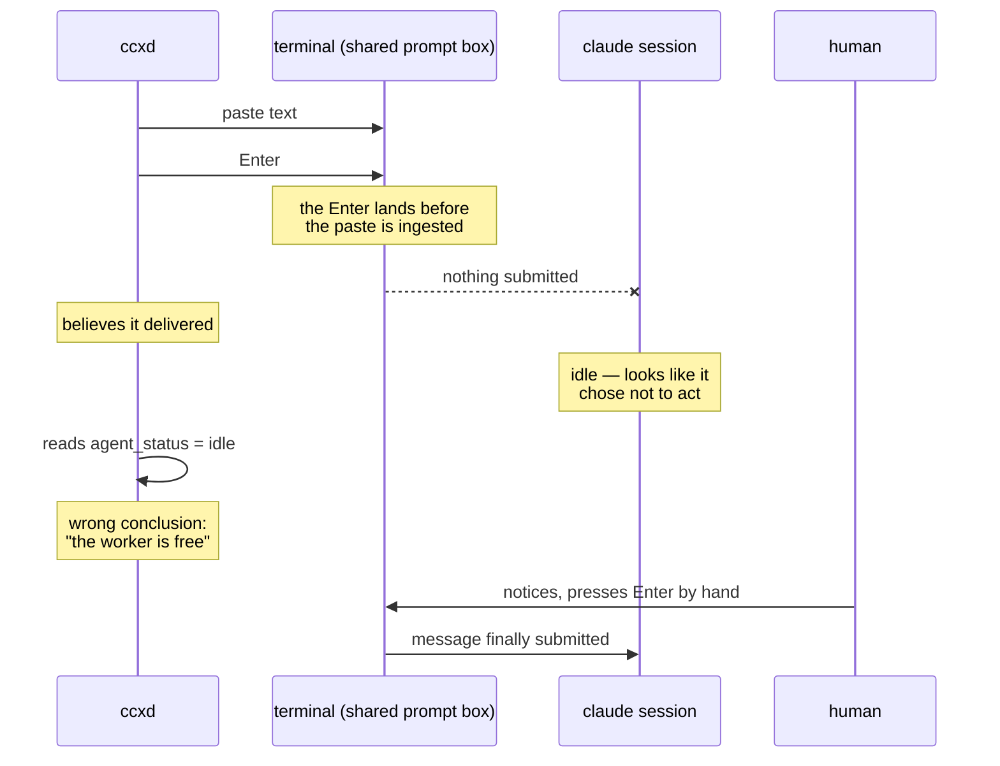
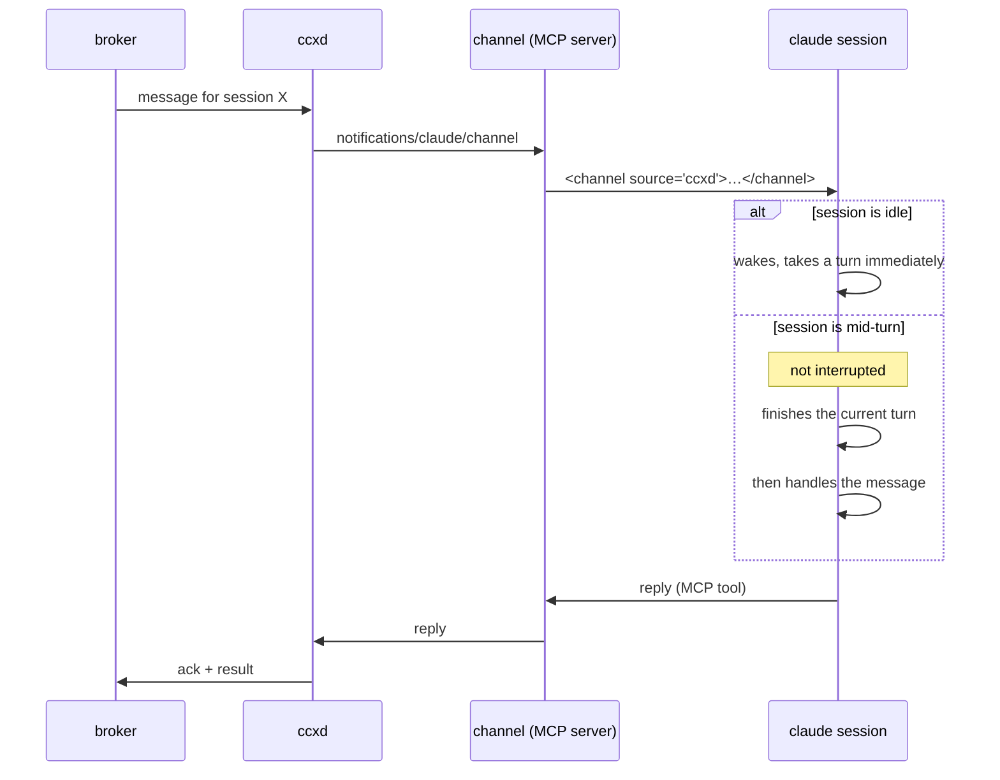

# Getting work into a running session

A resident agent pulls messages from a broker. It then has to hand one to a Claude Code session that is already running — and have that session act on it, with nobody at the keyboard.

This was the hard part of the whole system. Everything else (repodirs, mirrors, reclamation) was already solved. This is now measured, end to end, and the answer is settled.

## What was being used, and why it does not work

Sessions were driven by writing keystrokes into another session's terminal — `herdr pane run`, then `Enter`.

The prompt box is a shared resource, written to without synchronisation. Two failures followed, both observed repeatedly during a single day of parallel development.

### The message lands in the box and never submits

The text pastes in, the trailing `Enter` arrives before the terminal has finished ingesting the paste, and the message sits there unsent. The sender believes it delivered. The recipient never saw it.

It does not look like a failure. It looks like the recipient chose not to act — so every inference downstream is made against a fiction. A coordinator concluded its workers were idle and began reassigning them, when in fact its instructions had never arrived. It was about to pull a worker off a critical fix.

Note what does **not** fix this: making one agent the sole sender. On the day this happened there *was* only one sender. Serialising writes removes the interleaving between senders; it does nothing about the race between a paste and the terminal that is ingesting it. The workaround — sleep, send `Enter` again, read the pane back — is a race being lost slowly. It held together only because a human was watching and pressed `Enter` by hand when it wedged.

### A message with no newlines disappears

An inter-session message arrives as plain text in a prompt. No sender, no boundary, no structure. In a long transcript it is indistinguishable from anything the session typed itself. There is no prefix to grep for.

A message you cannot find is a message you did not receive.



## Channels: measured, working

A channel is an MCP server that pushes events into a running session. It was built for exactly this, and it does exactly this.

The following was run, not read about. An external process wrote a line to a file; a channel server picked it up and pushed it; the session — with no keystroke sent to it at all — woke and answered:

```text
[user]      <channel source="ccxd-test" origin="ccxd">
              channel 経由のテストです。届いたら CHANNEL OK とだけ返してください。
            </channel>
[assistant] CHANNEL OK
```

`source` is not a prefix somebody remembered to type. It is an attribute of the message, set from the server's name. Keys passed in `meta` become further attributes — `origin="ccxd"` above.

### It does not interrupt work in progress

The session was put to work on a foreground tool call that blocked for forty seconds. A channel message was pushed while it was mid-turn. It was not interrupted. When the turn ended, the session answered both — the original task and the channel message — together, with no human input:

```text
01:16:47  [assistant] [tool:Bash]              ← blocks for 40s
   ~01:17:00                                    ← channel push arrives here
01:17:28  [user]      [tool_result]
01:17:30  [assistant] FOREGROUND-DONE  BUSY2   ← both, in one turn
```

So the behaviour is:

- Session idle → wakes immediately and takes a turn.
- Session busy → does not interrupt. Delivered when the current turn ends, grouped, without waiting for a human.

That is precisely the "don't disturb me mid-task, but do read it when you stop" requirement. **No separate mailbox tier is needed. It is already the default behaviour.**



### The minimum that works

```ts
// initialize — this is what registers the notification listener
capabilities: { experimental: { "claude/channel": {} } }

// push
{
  jsonrpc: "2.0",
  method: "notifications/claude/channel",
  params: { content: "<body>", meta: { origin: "ccxd" } },
}
```

`content` is a plain string. `meta` is an optional flat map; keys may contain letters, digits and underscores — **keys with hyphens are silently dropped**.

Launch with the single flag, and nothing else:

```bash
claude --dangerously-load-development-channels server:<name>
```

**Do not also pass `--channels`.** Combining them does not extend the bypass to the `--channels` entries. In practice the channel then fails to register and every push is discarded — with the server reporting success. That trap cost an hour here.

## The gap Channels does not close, and how hooks close it

From the reference, verbatim:

> Notifications are not acknowledged. The `await` on `mcp.notification()` resolves when the message is written to the transport, not when Claude has processed it. If the session hasn't loaded your server as a channel, or the organization policy blocks it, **events are dropped silently with no error returned to your server**.

This is the same failure as send-keys wearing better clothes: the sender believes it delivered, and nothing contradicts it. It was hit here — the first push was silently discarded because of the flag trap above, while the server logged a successful send and the inbox drained. It took reading the session's own transcript to find out.

**Changing transport does not remove the need to confirm delivery. It only changes what you are failing to confirm.**

### Hooks fire for channel messages exactly as they do for a human

Measured. A channel-delivered message and a typed prompt produce the identical hook sequence:

```text
channel push  → UserPromptSubmit → Stop
human typing  → UserPromptSubmit → Stop
```

So `ccxd` gets its acknowledgements for free, from mechanisms that already exist:

| Hook | What ccxd learns |
|---|---|
| `SessionStart` | the session came up |
| `UserPromptSubmit` | **the message arrived** — receipt |
| `PreToolUse` | what the session is about to do |
| `PermissionRequest` | it is blocked, waiting for approval |
| `Notification` | it went idle |
| `Stop` | **the turn finished** — completion |

Every hook payload carries `session_id`. A hook that writes to a local socket — which is all a hook should ever do (#18) — is therefore a complete delivery-and-progress feed, with no new machinery invented for it.

This also retires `agent_status` as a source of truth. It is a lagging indicator; it was read five times in one day and gave the wrong answer each time. Hooks report what happened. Status reports what something inferred afterwards.

## A session driven with no human present can still stall on a question

An autonomously-driven session that calls `AskUserQuestion` stops and waits for someone to pick an option. A channel message cannot select an option — it is not a keystroke, and the choice is a terminal UI, not a message.

`claude -p` disables these prompts so a headless session never stalls. That escape is unavailable, because `-p` is excluded (see below).

The hook feed sees it, in full:

```text
tool_name:  AskUserQuestion
tool_input: { "questions": [{
    "question": "A と B、どちらを選びますか？",
    "options": [ {"label": "A", …}, {"label": "B", …} ]
}]}
```

So this is detectable — not merely as "something is stuck", but as *what is being asked and what the options are*. `PreToolUse` can also block, which leaves the door open for an orchestrator to answer on the session's behalf rather than merely notice.

The stalling itself remains an open design question. Detection is solved; what to do about it is not.

## One door in

Every mechanism is a way into a session. Having several is worse than having one, even if each works — a message that can arrive by four routes has four provenance stories, four orderings, and four ways to go missing.

```text
human (own web UI) ─┐
another session     ├─→ hub → broker → ccxd → channel (MCP push) → session
CI, external events ─┘
```

Deliberately excluded:

`claude -p` / headless. It works, and it is being moved toward paid metering upstream. A core path should not depend on someone else's pricing decision.

Sessions spawned by external events (web, chat integrations). A second way for work to arrive is a second set of failure modes.

`FileChanged` + `asyncRewake`. It would have let a daemon wake a session by dropping a file, with no MCP server at all. **It does not fire.** Tested four ways — project settings and user settings, with and without a `matcher`, on external writes and on a file the session had already read. A `PreToolUse` hook in the *same settings file* fired immediately, so hook loading was working; `FileChanged` simply did not respond. An AI documentation-QA tool stated confidently that it fires "regardless of whether the modification was made by Claude Code itself or an external process" — its own evidence was a plugin's `PostToolUse` config, and it noted in passing that implementations "might vary". Consulting a source and verifying a claim are different acts. Only the second one produced knowledge here.

The one thing that stays is not a delivery path. Terminal-level interruption — pressing Escape to stop a session mid-thought — cannot be a channel message, because it is not a message. `Esc` via keystroke remains, and it is a *single key* with no paste to race against, which is a materially different proposition from pasting a paragraph and hoping the `Enter` lands. It still must be confirmed rather than assumed.

## What is left to build

1. **The channel server, per session.** `ccxd` subscribes to the broker and pushes. The measured minimum above is most of it.
2. **The hook feed.** Every session's hooks write to a local socket; `ccxd` forwards to the hub. Receipt, completion, tool activity, stalls — all of it, from hooks that already fire.
3. **Group addressing** (#78). The sender names a group; `ccxd` fans out. Delivery is tracked per member, because "I told everyone" is the claim most often false and least often checked.
4. **Priority.** The sender — the PM role — decides. `ccxd` routes. It does not judge.
5. **A decision about stalled questions.** Detection is done. Whether an orchestrator answers on the session's behalf, or whether sessions are simply forbidden from asking, is not.
