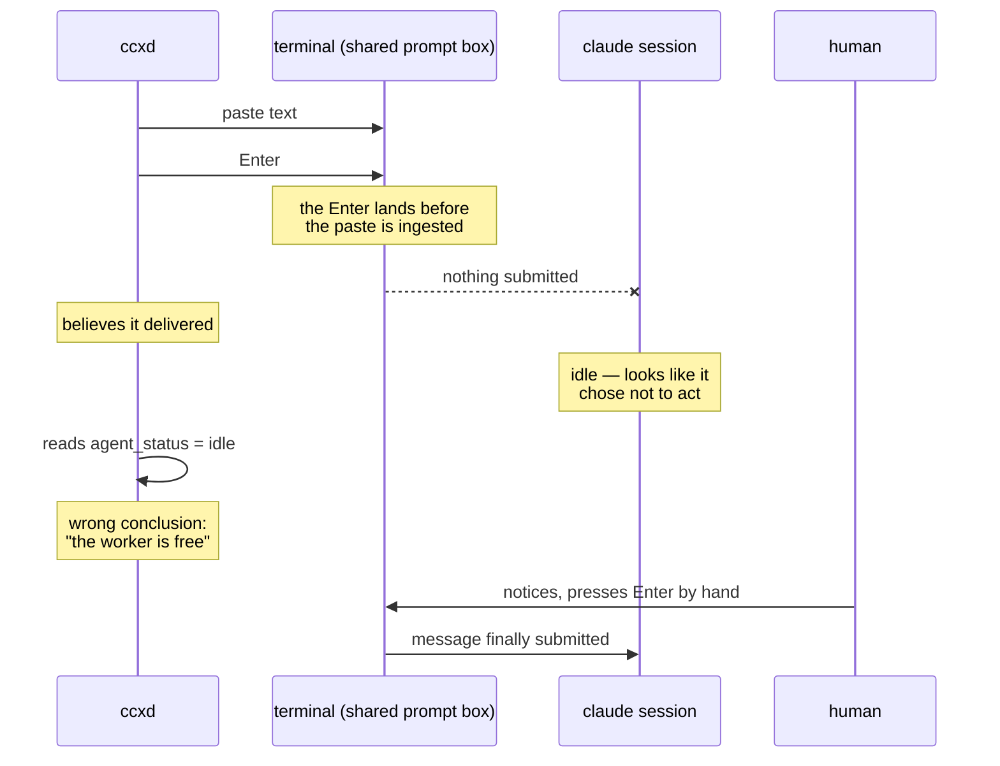
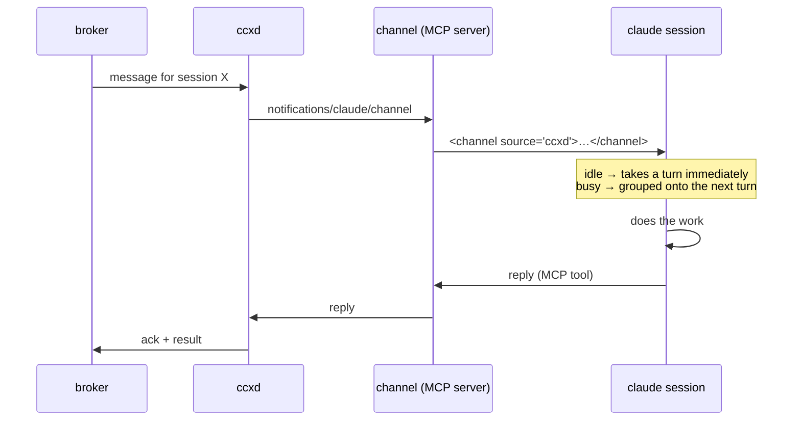

# Getting work into a running session

A resident agent pulls messages from a broker. It then has to hand one to a Claude Code session that is already running — and have that session act on it, with nobody at the keyboard.

This is the hard part of the whole system. Everything else (repodirs, mirrors, reclamation) is solved. This is not.

## What is being used today, and why it does not work

Sessions are driven by writing keystrokes into another session's terminal — `herdr pane run`, then `Enter`.

The prompt box is a shared resource, written to without synchronisation. Two things follow, and both were observed repeatedly during a single day of parallel development:

### The message lands in the box and never submits

The text pastes in, the trailing `Enter` arrives before the terminal has finished ingesting the paste, and the message sits there unsent. The sender believes it delivered. The recipient never saw it.

It does not look like a failure. It looks like the recipient chose not to act — so every inference downstream is made against a fiction. On one occasion a coordinator concluded its workers were idle and began reassigning them, when in fact its instructions had never arrived. It was about to pull a worker off a critical fix.

The workaround — sleep, send `Enter` again, read the pane back to check — is a race being lost slowly rather than a fix. It held together all day only because a human was watching and pressed `Enter` by hand when it wedged.

### A message with no newlines disappears

An inter-session message arrives as plain text in a prompt. No sender, no boundary, no structure. In a long transcript it is indistinguishable from anything the session typed itself. There is no prefix to grep for.

A message you cannot find is a message you did not receive.



## What the documentation actually allows

Verified against `code.claude.com/docs`. The distinction between quoted and inferred is kept explicit, because getting this wrong is how the current mess was reasoned into existence.

| Mechanism | Can it wake an idle session? | Status |
|---|---|---|
| Channels (MCP push) | Yes | Documented. Purpose-built for this |
| `asyncRewake` hook (exit code 2) | Yes | Documented |
| Scheduled tasks | Yes, on a timer | Documented. Polling, not push |
| `Stop` hook | No — it fires at the end of a turn | Documented as a "once per turn" event |
| `SessionStart` hook | No — context is injected, the session still waits | Documented explicitly |
| `UserPromptSubmit` hook | No — "external processes cannot trigger this hook" | Documented explicitly |
| `Notification` hook | No — "does not initiate a model turn" | Documented explicitly |
| `FileChanged` hook (+ `asyncRewake`) | No — measured, four ways, does not fire | Contradicts one AI-doc source; the measurement wins |
| Writing keystrokes | Yes, unreliably | What is in use today |

### Channels

An MCP server that pushes events into a running session. It is what this architecture wants.

```text
<channel source="ccxd" severity="high" run_id="1234">
rebase #60 onto main and re-run CI
</channel>
```

- The server declares `capabilities.experimental['claude/channel']` and runs over stdio, like any MCP server.
- It pushes with `mcp.notification({ method: 'notifications/claude/channel', params: { content, meta } })`.
- An idle session takes a turn immediately. A busy one receives the events grouped on its next turn.
- `source` is set automatically from the server's name. Keys in `meta` become further attributes.
- Replying is a normal MCP tool on the same server.
- Enabled per session: `claude --channels plugin:<name>@<marketplace>`.

Two things follow that matter more than they look:

Nothing is written into a prompt box, so there is no race to lose. The delivery failure that stalled a whole day of work cannot occur.

`source` is an attribute of the message, not a prefix somebody remembered to type. The "I cannot find the message in the transcript" problem is not mitigated — it stops existing.



### The constraints, stated plainly

Channels is a research preview. The flag syntax and the protocol contract may change. That is a real cost, not a footnote — see the tracking issue.

It requires claude.ai or Console API authentication. It does not work on Bedrock, Vertex, or Foundry.

Events only arrive while the session is open. A resident daemon does not make a session resident. Who starts the session, and who restarts it when it dies, is a separate problem — and it is the one `ccx repodir open` and session reclamation exist to solve.

### `asyncRewake`, and why it is worth knowing about

A hook configured with `asyncRewake: true` runs in the background, and exiting with code 2 wakes Claude "immediately even when the session is idle" — quoted from the hook reference.

This is a documented way to wake an idle session that is not Channels. It is not a message transport (a hook is invoked by Claude Code, never by an external process), so a daemon cannot use it to *deliver* anything. But it can be used to *wake* a session that will then read a local inbox — which is precisely the mailbox tier.

### `Stop`, and why it is not the answer

A `Stop` hook can return `decision: "block"` with a `reason`, and the turn continues instead of ending. That is real and documented, and it makes "drain the queue when the agent finishes" work.

But `Stop` fires when a turn ends. A session that has already gone idle is not ending a turn, so nothing fires. It can extend a turn that is already happening; it cannot restart one that finished. And Claude Code "overrides the hook and ends the turn after 8 consecutive blocks" — an unbounded poll loop is capped by the engine.

So it is a useful complement (drain on natural turn end), not a substitute.

## One door in

Every mechanism above is a way into a session. Having several is worse than having one, even if each works — a message that can arrive by four routes is a message whose provenance, ordering and delivery guarantees are four different things.

So the decision is: everything enters a session through the same door.

```text
human (own web UI) ─┐
another session     ├─→ hub → broker → ccxd → channel (MCP push) → session
CI, external events ─┘
```

Deliberately excluded, and why:

`claude -p` / headless. It works, and it is being moved toward paid metering upstream. Depending on it means depending on someone else's pricing decision for a core path.

Sessions spawned by external events (web, chat integrations). A second way for work to arrive is a second set of failure modes, a second provenance story, and a second thing to reason about when something goes missing.

`FileChanged` + `asyncRewake`. It looked like a way to reach a session without writing an MCP server at all — a daemon drops a file, the hook wakes the session. It does not work. Measured, four ways, below.

The single exception is safe-send, and it is not a delivery path. Terminal-level interrupts — pressing Escape to stop a session mid-thought — cannot be expressed as a channel message, because they are not messages. It stays for that, and for nothing else.

## `FileChanged` does not fire. Measured.

A hook is invoked by Claude Code, never by an external process — so a daemon cannot use a hook to *deliver* a message. But `FileChanged` looked like a way to have a daemon *wake* a session: drop a file, the hook fires, `asyncRewake` exits 2, the session wakes and reads a local inbox. No MCP server required.

It was worth checking, because Channels is a research preview with an authentication constraint, and a mechanism that needs neither would be a genuinely cheaper path.

It does not fire.

| Setup | Fired? |
|---|---|
| Project settings, `matcher: "*"`, external write to the working directory | No |
| User settings (global), `matcher: "*"`, external write | No |
| Project settings, no `matcher` (matching the shape already present in this machine's global config) | No |
| A file the session had already read, then modified by an external process | No |

The control experiment matters: a `PreToolUse` hook placed in the *same project settings file* fired immediately. Hook loading works. `FileChanged` specifically does not respond to any of the above.

### On the source that said it would

An AI documentation-QA tool was asked, and answered confidently:

> The `FileChanged` hook is triggered when a file on disk is modified, regardless of whether the modification was made by Claude Code itself or an external process.

That contradicts the measurement. Reading its answer closely, its evidence came from a plugin's `PostToolUse` configuration, and it noted in passing that "its specific implementation and usage might vary" — a confident sentence resting on an admission of uncertainty.

The tool was the right tool to reach for. Its answer was still something to check, not something to believe. Consulting a source and verifying a claim are different acts, and only the second one produces knowledge.

## The order this has to be built in

Nothing here is a nice-to-have. The current transport failed, in production, repeatedly, on the day it was used.

1. Pass the first instruction as a launch argument. `claude "<initialTask>"` submits and starts working with no keystroke sent at all — measured. Every session's opening message stops going through the box that drops it.
2. Channels. The remaining messages stop going through it too.
3. safe-send, as the floor. Verify submission rather than assume it; keep it for sessions with no channel, and for terminal-level interrupts a channel cannot express.
4. The conversation view. A stalled exchange is invisible at the pane level and obvious at the conversation level — which is the whole reason the failure above went unnoticed for as long as it did.
