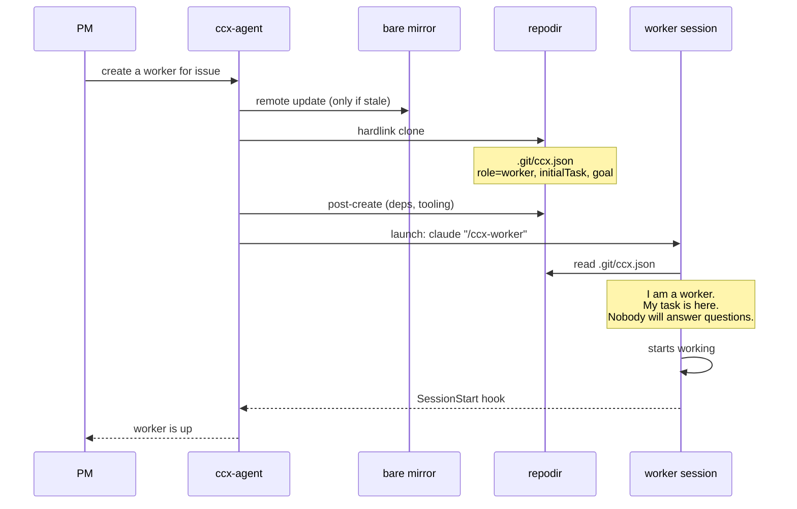
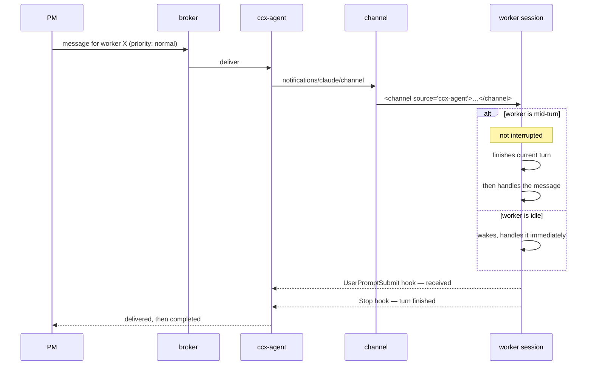
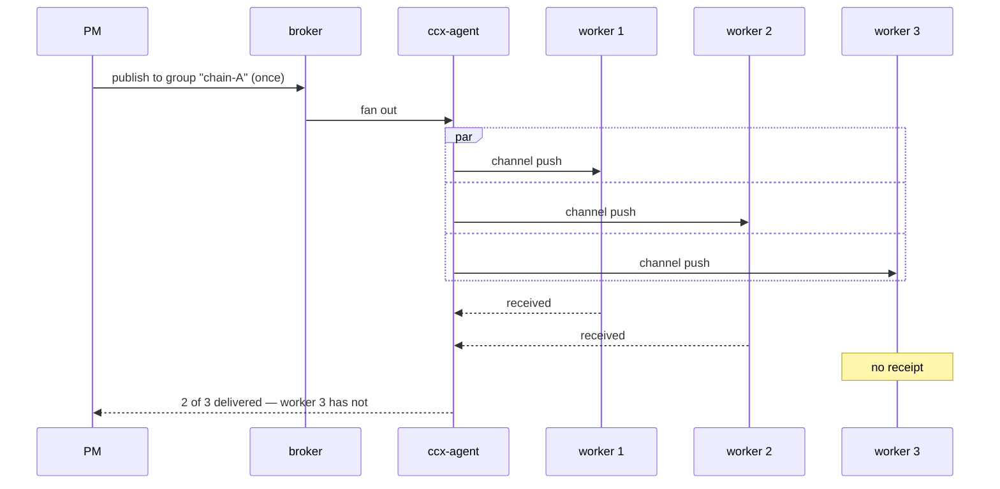
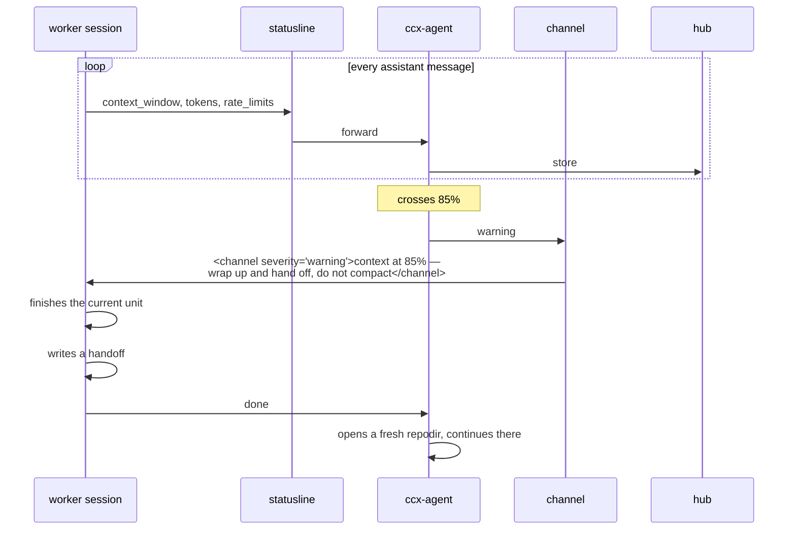
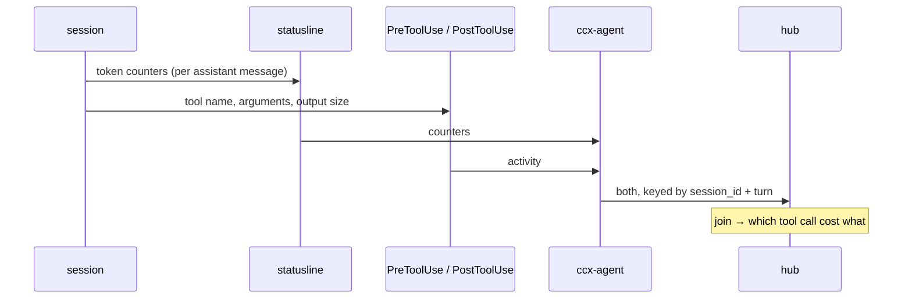
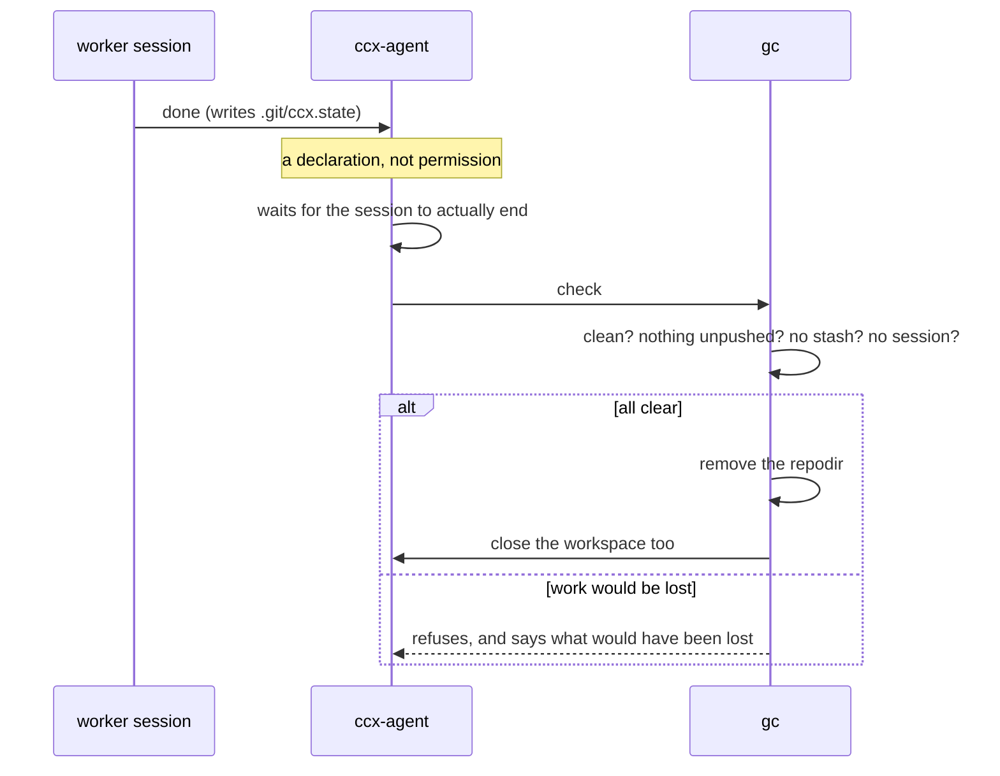
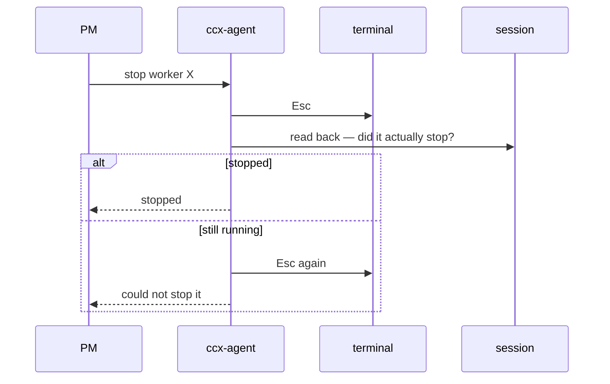

# Use cases

Each use case states what happens, in order, and what has to be true for it to count as satisfied. An issue that closes without its acceptance conditions holding has not closed anything.

The conditions are written to be checkable. "The session receives the message" is not checkable. "The message appears in the session's transcript wrapped in a `<channel>` tag, with no keystroke sent" is.

Terms: **ccx-agent** is the resident agent, one per machine. **PM** is the orchestrating session. **worker** is a session with no human watching it.

---

## UC-1 — Stand up a worker

A worker is created, opened, and starts working. Nobody types anything.



**Satisfied when**

- The repodir exists at `<root>/<host>/<owner>/<repo>/<dir-id>` and its `.git` pack shares an inode with the mirror.
- `.git/ccx.json` carries `role`, `initialTask` and `goal` — **`goal` is populated, not empty.** (#65 exists because it never was.)
- The session begins work with **no keystroke sent to it** — the launch argument is the whole instruction.
- The task was **read from `ccx.json`**, not passed on the command line.
- `SessionStart` reaches ccx-agent, so the PM learns the worker exists without polling.

Issues: #4, #57, #65, #69, #82

---

## UC-2 — Give a worker an instruction

The PM tells a worker something. The worker is mid-task and must not be interrupted.



**Satisfied when**

- The message reaches the session **with no keystroke sent**.
- A busy worker is **not interrupted**; a foreground tool call runs to completion first.
- An idle worker **wakes on its own** and takes a turn.
- `source` is present on the delivered message and was **not** typed by the sender.
- **Delivery is confirmed, not assumed.** `UserPromptSubmit` firing is the receipt; channel pushes are not acknowledged by the protocol, and a message dropped for any reason (a misconfigured channel, an org policy) looks identical to a message delivered.
- The PM learns of completion from `Stop`, not from watching a status field.

Issues: #16, #18, #20, #23, #26

---

## UC-3 — Tell every worker on a chain the same thing

The merge order changed. Four workers need to know.



**Satisfied when**

- The sender publishes **once**, naming a group. It does not enumerate members.
- **Delivery is tracked per member.** "Sent to the group" is not a delivery guarantee; the only interesting question is *which member did not get it*.
- A member that did not receive it is **reported as such**, not silently absent.

The same message was sent four times by hand today, and nobody checked how many arrived. At least one did not.

Issues: #26, #78

---

## UC-4 — A worker needs a decision it cannot make

The worker would normally stop and ask. Nobody is there.

```mermaid
sequenceDiagram
    participant S as worker session
    participant H as PreToolUse hook
    participant AGENT as ccx-agent
    participant PM

    S->>H: AskUserQuestion(question, options)
    Note over H: role=worker → no human here
    H-->>S: denied — ask the PM instead, and keep working
    H->>AGENT: question + options
    AGENT->>PM: worker X is asking: …

    S->>S: continues with other work

    PM->>AGENT: the answer is B
    AGENT->>S: <channel source="ccx-agent">answer: B</channel>
    Note over S: not interrupted;<br/>picked up at end of turn
    S->>S: resumes the blocked path
```

**Satisfied when**

- The worker **does not stall**. It is denied *and given the alternative in the same breath* — a gate that removes an option without offering another is a gate that gets worked around.
- The PM sees **the question and the options**, not merely "a worker is stuck".
- The worker **keeps working** while it waits. Ask, continue, receive later.
- The gate is **off when `role` is unset.** It bites only where a role was deliberately chosen.
- Every other way of stalling an unattended session has been enumerated first. Closing one of several is how you come to believe the problem is solved.

Issues: #80, #81, #82

---

## UC-5 — A worker is running out of context



**Satisfied when**

- The session is **told**. It cannot see its own remaining context; something else has to say so.
- The warning **does not interrupt** work in progress.
- It fires **once per threshold crossing**, not every turn. A warning repeated every message is noise, and noise is ignored.
- The session hands off **instead of compacting**. Compaction is lossy and silent — the session carries on reasoning from a summary of its own reasoning, and nothing announces the degradation. A fresh repodir costs 0.07 seconds. Making repodirs cheap was the point; this is where the cheapness is spent.

Issues: #20, #23, #83

---

## UC-6 — Find out where the context went

Consumption was startling today and nobody can say why, because nobody was measuring. There are suspects. A suspect is not a finding.



**Satisfied when**

- The **delta per turn** is recorded, not just the current level. A gauge says the tank is low; it does not say where the hole is.
- Token counters are **joined to the tool activity in the same turn**, so a spike can be attributed to a specific call rather than guessed at.
- The breakdown distinguishes `input`, `output`, `cache_read` and `cache_creation`. Fresh reads and cache hits are not the same expense and must not be summed into one number.

Issues: #18, #20, #83

---

## UC-7 — Reclaim a finished repodir



**Satisfied when**

- "Done" is a **declaration, never an authorisation.** A session that says it is finished while holding unpushed commits does not lose them.
- Deletion happens **after** the session has actually ended — the session declaring itself done is running *inside* the directory it is declaring done.
- The safety checks run **immediately before deletion**, not at planning time. A session can start, or a file can change, in between.
- The **workspace goes with the repodir.** Reclamation that covers half of what is created just moves the leftovers to the half it does not cover — which is how 37 workspaces accumulated after the directories were fixed.
- Anything refused says **what would have been lost**, so a human can decide rather than guess.

Issues: #2, #5, #64

---

## UC-8 — Stop a session that is going wrong



**Satisfied when**

- Interruption is **confirmed, not assumed.** "Sent Esc" and "it stopped" are different claims.
- Failure to stop is **reported as a failure**, not left to look like success.

This is the one thing that stays on keystrokes. An interrupt is not a message — there is nothing to deliver, only a key to press — so a channel cannot express it. But it is a *single key* with no paste to race against, which is a materially different proposition from pasting a paragraph and hoping the `Enter` lands.

Issues: #16

---

## What every one of these has in common

Each acceptance list contains a condition about **confirming rather than assuming**. That is not stylistic. Six times in one day, a signal was read as evidence of a result:

- `CodeRabbit: Review completed` — nothing had been reviewed.
- `CI green, mergeable` — merging it would have broken the build.
- `agent_status: done` — the worker was mid-fix on a critical bug.
- A hook was installed — it was passing every input straight through.
- A message was sent — it sat unsubmitted until a human pressed Enter.
- A channel push succeeded — it was silently discarded.

Green, complete, delivered, mergeable: each is evidence that *something happened*. None is evidence that **the right thing happened**. Every use case above is built to close that gap, because changing the transport does not remove the habit — it only changes what is going unconfirmed.
